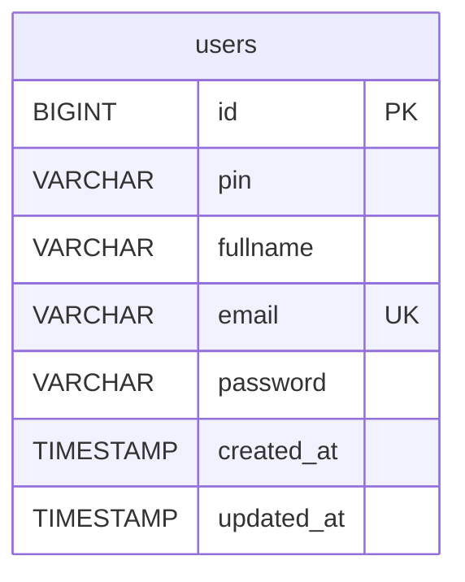

# Endpoint Backend Login, getalldata, dan Register

## Berikut merupakan source code Golang untuk membuat endpoint backend untuk login dan register

### Screenshoot pengujian
<table>
    <tr>
        <td>Register data</td>
        <td>Tampilkan Get All Data Users</td>
        <td>Login</td>
    </tr>
    <tr>
        <td></td>
        <td></td>
        <td></td>
    </tr>
</table>

Berikut merupakan tampilan untuk membuat endpoint Login dan Register, dan tampilkan semua data sederhana

untuk alur program berjalan

Models -> Repo -> Service -> handler -> container 

penyimpanan pada endpoint ini menggunakan Database SQL

untuk melakukan pengujian saya menggunakan ekstension VSCode REST Client dengan Script
### Test di tools Http Method
```bash
### Register
POST /users HTTP/1.1
Host: localhost:8080
Content-Type: application/x-www-form-urlencoded

fullname=Heri&email=heri@mail.com&password=123


### Get All Data
GET /users HTTP/1.1
Host: localhost:8080

### Login
POST /login HTTP/1.1
Host: localhost:8080
Content-Type: application/x-www-form-urlencoded

email=dimas4@mail.com&password=123
```

### install dependancy
```bash
go mod tidy
```

## ERD Table

